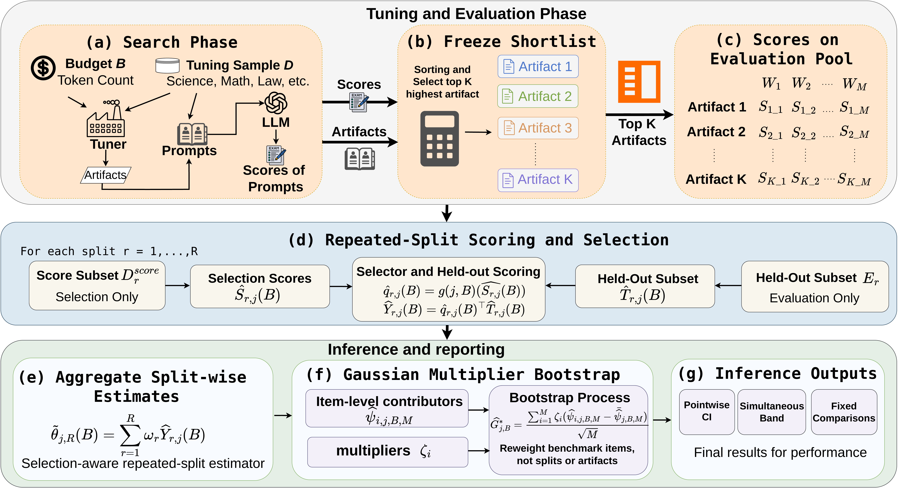

# SIREN — Selection-Aware Reporting for Adaptive LLM Evaluation

> **Supplementary materials for NeurIPS 2026 submission.**
> Anonymous repository for double-blind review.

This package contains everything needed to reproduce the experimental results
reported in the paper, plus drop-in LaTeX files for the appendix tables.

---

## SIREN at a glance



SIREN replaces the naive in-sample winner with a procedure-level estimator
that uses **soft selection over a top-K shortlist** and **repeated-split
held-out scoring**, then quantifies uncertainty via a **Gaussian multiplier
bootstrap on the plug-in influence function**. The bootstrap reweights
benchmark items rather than splits or artifacts, yielding pointwise CIs,
simultaneous bands, and fixed-comparison statements at the cost of a single
length-*M* dot product per resample.

---

## Headline results

**Setup:** 2 subjects (MMLU-Pro Math, Law) × 2 tuners (random search, DSPy)
× 11 open-weight LLMs × 4 token budgets = **176 cells**.
Convention: ties (estimate = θ_B*) count as wrong-direction.

### Directional accuracy (right-direction calls / total cells)

| Method            | Math RS  | Math DSPy | Law RS   | Law DSPy | **Total**            |
|-------------------|:--------:|:---------:|:--------:|:--------:|:--------------------:|
| M1 (naive max)    | 37/44    | 33/44     | 15/44    | 40/44    | 125/176 (71%)        |
| M3 (single split) | 35/44    | 31/44     | 20/44    | 35/44    | 121/176 (69%)        |
| M4 (R-split *t*)  | 29/44    | 39/44     | 27/44    | 40/44    | 135/176 (77%)        |
| **SIREN**         | **42/44**| **43/44** | **42/44**| **40/44**| **167/176 (95%)**    |

### Mean signed bias (percentage points, θ̂_A − θ_A*)

| Method   | Math RS | Math DSPy | Law RS  | Law DSPy |
|----------|:-------:|:---------:|:-------:|:--------:|
| M1       | +1.37   | +1.43     | +1.90   | +1.01    |
| **SIREN**| **+0.04** | **−0.05** | **+0.08** | **−0.20** |

M1's bias is **positive in 176/176 cells** — the empirical signature of
selection bias rather than sampling noise.

### PromptEval comparison (signed bias range across all 4 cells, by *f*)

| Observation fraction *f*       | Bias range (pp)        |
|--------------------------------|:----------------------:|
| f = 0.05 (sparse)              | −1.67 to **−12.72**    |
| f = 1.00 (= M1, dense)         | +0.77 to +5.19         |
| **SIREN**                      | **−0.21 to +0.11**     |

PromptEval exhibits a U-shaped bias trade-off across *f*: sparse PromptEval
shrinks toward the population mean (severe underestimation), dense PromptEval
reduces to the M1 winner (re-introducing selection bias). SIREN remains
calibrated at every budget across all four cells.

---

## Repository structure

```
.
├── README.md
├── figure/
│   └── pipeline.png                     ← architecture diagram
│
├── 01_appendix_tex/                     ← drop into your paper
│   ├── appendix_full.tex                  primary deliverable
│   ├── siren_per_model_all4_appendix.tex
│   ├── prompteval_per_model_all4_appendix.tex
│   ├── directional_summary_tables.tex
│   └── prompteval_per_budget_wraptables.tex
│
├── 02_data_csv/                         ← processed analysis data
│   ├── math_overlap_results.csv         (88 rows: 11 models × 4 budgets × 2 tuners)
│   ├── math_full_results.csv
│   └── law_dspy_full_results.csv
│
├── 03_analysis_scripts/                 ← reproducibility
│   ├── build_tensor.py
│   ├── compare_models.py
│   ├── compute_ground_truth.py
│   ├── exp1_coverage.py                 Theory Validation — Study A
│   ├── exp2_near_tie.py                 Theory Validation — Study B
│   ├── exp3_optimism.py                 Theory Validation — Study C
│   ├── study_e_dspy_randsearch_law.py
│   ├── study_e_miprov2_law.py
│   ├── study_e_multimodel_api.py
│   ├── study_e_multimodel_law.py
│   ├── study_h_prompteval_law.py
│   └── study_h_prompteval_math.py
│
└── 04_raw_results/                      ← raw experiment outputs
    ├── law_data_tar.gz                  Law: all 11 models × 2 tuners
    ├── original_math_results_tar.gz     Math RS: 10 of 11 models
    ├── qwen3_math_rs_overnight.tar.gz   Math RS: Qwen3-8B (separate run)
    ├── dspy_rs_math_results_tar.gz      Math DSPy: all 11 models
    ├── dspy_rs_results_tar.gz           older variant, kept for traceability
    ├── study_h_prompteval_math_results.json
    └── study_h_prompteval_law_results.json
```

---

## Quick start for reviewers

### To inspect the appendix LaTeX

Open `01_appendix_tex/appendix_full.tex` directly. It contains the complete
`\section{Additional experiments}` block with all 11 appendix tables and
Theory Validation (Studies A–C) prose verbatim from the paper draft.

### To verify a number from a table

All directional and bias counts trace back to:

- **Math** → `02_data_csv/math_overlap_results.csv`
- **Law** → JSONs inside `04_raw_results/law_data_tar.gz`
- **PromptEval** (both subjects) → the two `study_h_prompteval_*.json` files

### To regenerate from raw data

```bash
# Extract Law results
mkdir -p law_work
tar xzf 04_raw_results/law_data_tar.gz -C law_work

# Re-run PromptEval analysis (~30 sec on a CPU)
cd law_work
python ../03_analysis_scripts/study_h_prompteval_law.py

# Compare against shipped JSON
diff <(python -c "import json; print(json.dumps(json.load(open('study_h_prompteval_law_results.json')), sort_keys=True))") \
     <(python -c "import json; print(json.dumps(json.load(open('../04_raw_results/study_h_prompteval_law_results.json')), sort_keys=True))")
```

The Math PromptEval JSON does not require regeneration — it is shipped
directly in `04_raw_results/study_h_prompteval_math_results.json`.

---

## Scripts at a glance

### Theory Validation (Studies A–C): controlled simulations
| Script              | Validates                                          |
|---------------------|----------------------------------------------------|
| `exp1_coverage.py`  | Multiplier-bootstrap coverage (Theorem 1+2)        |
| `exp2_near_tie.py`  | Hard-argmax near-tie undercoverage (Proposition 3) |
| `exp3_optimism.py`  | √(2 log H) same-data optimism (Proposition 4)      |

### Real-data experiments (Studies E and H on MMLU-Pro)
| Script                              | Generates                            |
|-------------------------------------|--------------------------------------|
| `study_e_multimodel_law.py`         | Law random-search results            |
| `study_e_dspy_randsearch_law.py`    | Law DSPy results                     |
| `study_e_miprov2_law.py`            | MIPROv2 variant (not used in final)  |
| `study_e_multimodel_api.py`         | API-served LLM variant               |
| `study_h_prompteval_law.py`         | PromptEval baseline on Law           |
| `study_h_prompteval_math.py`        | PromptEval baseline on Math          |

### Analysis utilities
| Script                       | Purpose                                          |
|------------------------------|--------------------------------------------------|
| `build_tensor.py`            | Constructs (selection_fold, eval_fold) tensors   |
| `compute_ground_truth.py`    | θ* via 10K Monte Carlo redraws of the split design |
| `compare_models.py`          | Aggregates per-model results across budgets      |

---

## How to run

### Reproduce a single LLM result (e.g., Llama-3.1-8B on MMLU-Pro Law, DSPy)

```bash
# 1. Start a vLLM server for the target model
python -m vllm.entrypoints.openai.api_server \
    --model meta-llama/Llama-3.1-8B-Instruct \
    --gpu-memory-utilization 0.85 \
    --max-model-len 2048 --max-num-seqs 8 --port 8000

# 2. Run Study E (DSPy variant) for that model
python 03_analysis_scripts/study_e_dspy_randsearch_law.py \
    --model meta-llama/Llama-3.1-8B-Instruct --port 8000 \
    --results-dir results/llama_law

# 3. Compute the procedure-level ground truth via Monte Carlo
python 03_analysis_scripts/compute_ground_truth.py \
    --results-dir results/llama_law

# 4. Aggregate into a per-model summary
python 03_analysis_scripts/compare_models.py --results-dir results/llama_law
```

Each model run takes ~2–6 hours on a single RTX 4090. Full reproduction across
all 11 models × 4 budgets × 2 subjects × 2 tuners requires ~40 GPU-days.

### Reproduce the PromptEval baseline (no GPU needed)

```bash
# Extract the raw Law results and run PromptEval analysis (~30 sec on CPU)
mkdir -p law_work && tar xzf 04_raw_results/law_data_tar.gz -C law_work
cd law_work
python ../03_analysis_scripts/study_h_prompteval_law.py
```

### Reproduce Theory Validation simulations (Studies A–C, no GPU needed)

```bash
python 03_analysis_scripts/exp1_coverage.py    # Study A: ~10 min
python 03_analysis_scripts/exp2_near_tie.py    # Study B: ~15 min
python 03_analysis_scripts/exp3_optimism.py    # Study C: ~5 min
```

### Drop the appendix into a paper

Open `01_appendix_tex/appendix_full.tex` and copy its contents into your
paper's appendix. Required preamble packages: `xcolor`, `multirow`,
`booktabs`, `graphicx`, `placeins`, `wrapfig`, `pifont`. The file uses
`\cmark` and `\xmark` macros from `pifont`.

---

## Method ↔ table-column mapping (legacy convention)

The appendix tables use a column convention inherited from the early Law
tables, where JSON method-key ≠ column header:

| Column header | Underlying JSON key | Description                     |
|---------------|---------------------|---------------------------------|
| `M1/M2`       | `m1`                | Naive max (M2 = M1 + Wald, identical point estimate) |
| `M3`          | `m4`                | Single-split holdout            |
| `M4`          | `m5`                | R-split argmax with Student-*t* CI |
| `SIREN`       | `m7`                | Full influence function + multiplier bootstrap |

(This convention is consistent across all 11 appendix tables.)

---

## Data note: Qwen3-8B Math RS

Qwen3-8B Math RS data lives in `qwen3_math_rs_overnight.tar.gz`, **not** in
`original_math_results_tar.gz`. Qwen3 was run via a separate overnight
script and stored under a non-standard path on the original server. The
JSON structure is equivalent up to one minor field-name difference (`m5`
in place of `m6` for the *t*-CI ablation; values are identical).

JSON structure verified:
- Top-level keys: `[500000, 1500000, 3000000, 6500000]`
- Per-budget: `m7` (SIREN), `comparison.{m1..m5}`, `top_k_scores` (length 10)
- `top_k_scores=10` confirms K=10 Math RS convention

---

## Excluded from this package (intentional)

To keep the package submission-focused, the following were excluded:

- **Gemini 2.5 Flash debugging artifacts** — multi-day dead-end, no usable results.
- **GSM8K early-stage experiments** — superseded by MMLU-Pro.
- **Older Math LaTeX files** (`table4_math_500k.tex`, `math_section_latex.tex`,
  etc.) — superseded by `appendix_full.tex`.
- **Intermediate appendix drafts** — superseded by the final `appendix_full.tex`.

---

## License

This code is released under the MIT License. See [LICENSE](LICENSE) for details.

If you use SIREN in your research, please cite:

```bibtex
@article{xu2026siren,
title={Towards Reliable LLM Evaluation: Correcting the Winner's Curse in Adaptive Benchmarking},
author={Xu, Yang and Zhang, Jiefu and Sun, Haixiang and Zhou, Zihan and Cao, Tianyu and Aggarwal, Vaneet},
journal={arXiv preprint arXiv:<ARXIV_ID>},
year={2026}
}
```
